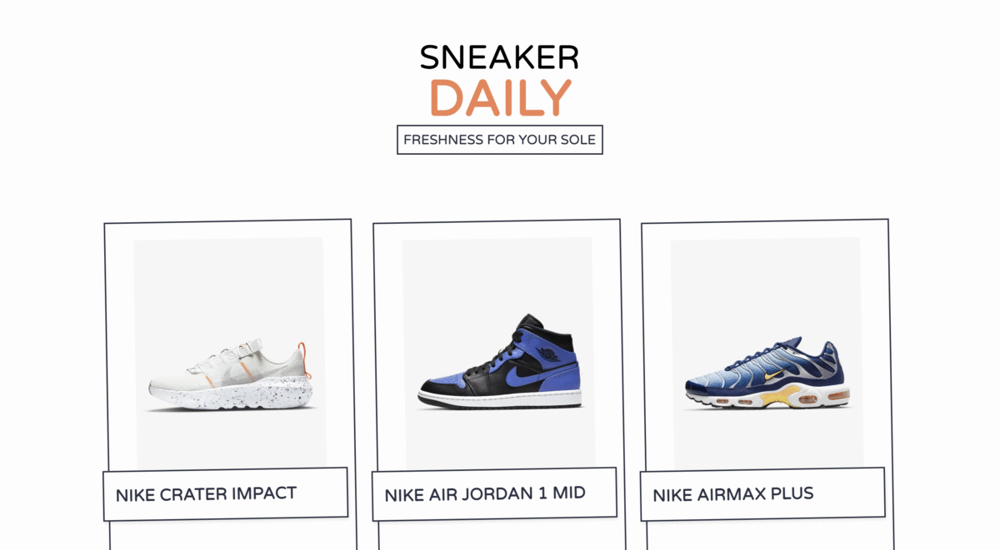

# Sneaker Daily - Freshness for your Sole! 🚀🚀🚀

[](https://www.codefactor.io/repository/github/remrkabledev/sneaker-daily)

A simple application that overviews some sneakers. There are no extravagant features here, just an app that displays sneakers whose data is fed from a CMS. 




This application is built with [Next.js](https://nextjs.org/) and [Contentful](https://www.contentful.com/). 

## Getting Started 🏁

These instructions will get you a copy of the project up and running on your local machine for development and testing purposes.
### Prerequisites

What things you need to install the software and how to install them

```
NPM / Yarn
Code Editor (This app was built on VSCode)
Git
```

### Installing

To get this project on your local machine, you first need to clone it using the `git clone` command.

```
git clone https://github.com/reMRKableDev/sneaker-daily.git
```

Running this on your terminal will ensure you receive the latest version with all it's changes.

Once you've cloned, navigate into the project folder and run

```
npm install
```

This should retrieve all the necessary dependencies named in the `package.json` file.

## Authors 💻

- **Malcolm R. Kente** - _Initial work_ - [reMRKable Dev](https://remrkabledev.com/)

## Acknowledgments 🗣️

The Net Ninja's [Next.js + Contentful YouTube series](https://www.youtube.com/playlist?list=PL4cUxeGkcC9jClk8wl1yJcN3Zlrr8YSA1)